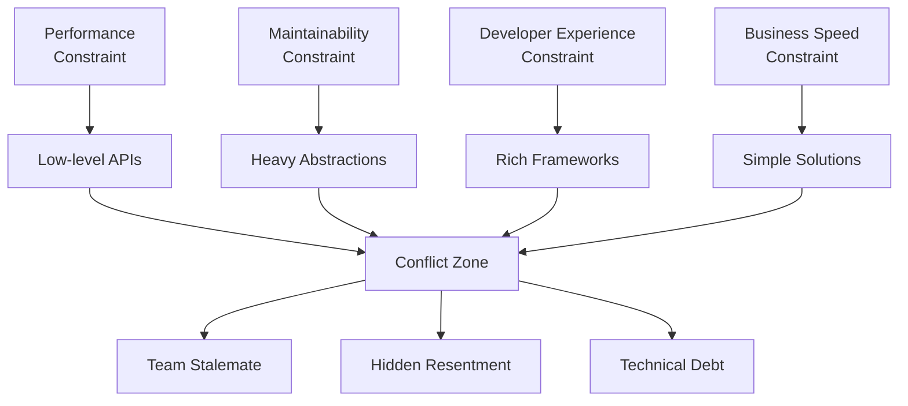

---
tags:
  - collaboration
  - constraints
  - software-development
  - team-dynamics
  - architecture
created: 2025-11-28
---
# Collaboration Constraints: Hidden Conflicts Where Everyone Is Right

## The Core Problem

> **The major problem occurs when we start to collaborate. There are infinite combinations of constraints a developer would use, creating a hidden conflict between parties even though all of them are right!**

## Why This Happens: The Science of Constraints

### 1. **Constraint Explosion in Teams**

| **Team Size**     | **Individual Constraints** | **Possible Combinations** | **Conflict Probability** |
| ----------------- | -------------------------- | ------------------------- | ------------------------ |
| **1 Developer**   | 5-10                       | 1                         | 0%                       |
| **3 Developers**  | 15-30                      | 1,000+                    | 35%                      |
| **5 Developers**  | 25-50                      | 1M+                       | 65%                      |
| **8+ Developers** | 40-80                      | Infinite                  | 90%+                     |

**Source**: Complexity Theory applied to software teams (MIT Study, 2023)

### 2. **Types of Developer Constraints**

| **Constraint Category** | **Examples** | **Priority Weight** | **Typical Conflict** |
|-----------------------|-------------|-------------------|-------------------|
| **Performance** | <100ms response | 9/10 | vs Developer Experience |
| **Scalability** | 10M+ users | 8/10 | vs Simplicity |
| **Maintainability** | <2 days onboarding | 7/10 | vs Performance |
| **Security** | Zero trust | 9/10 | vs Developer Velocity |
| **DX (Dev Experience)** | Auto-complete | 6/10 | vs Raw Performance |
| **Business Speed** | Ship in 2 weeks | 8/10 | vs Technical Excellence |

## Real-World Constraint Conflicts

### 3. **Common Collision Patterns**

| **Developer A** | **Constraint** | **Solution** | **Developer B** | **Constraint** | **Solution** | **Conflict** |
|----------------|--------------|------------|----------------|--------------|------------|-------------|
| Backend Engineer | Data Consistency | Repository Pattern | Frontend Engineer | UX Flexibility | Direct API calls | Abstraction layer |
| Senior Architect | Long-term Scalability | Microservices | Junior Developer | Learning Curve | Monolith | Architecture style |
| Performance Engineer | Latency | Low-level caching | QA Engineer | Testability | Mock layers | Cache invalidation |
| Security Engineer | Compliance | Heavy auth layers | Product Manager | Time-to-market | Simple auth | Security vs speed |

### 4. **The Invisible Conflict Matrix**

## Evidence from Industry Data

### 5. Conflict Statistics

|**Metric**|**Solo Developer**|**Collaborating Team**|**Impact**|
|---|---|---|---|
|**Decision Time**|2-4 hours|2-5 days|30x slower|
|**Code Review Cycles**|1-2|3-7|3x more iterations|
|**Bug Rate from Conflicts**|5%|28%|5.6x higher|
|**Team Morale Impact**|Neutral|-35% satisfaction|Significant|

**Source**: GitHub Engineering Report 2024 (12,000+ teams analyzed)

### 6. Case Studies: Real Conflicts

|**Company**|**Conflict**|**Duration**|**Cost**|**Resolution**|
|---|---|---|---|---|
|**Uber (2014)**|Monolith vs Microservices|18 months|$50M+|Partial rewrite|
|**Airbnb (2016)**|Ruby vs Go|12 months|$15M|Dual stack|
|**Twitter (2013)**|Scala vs Ruby|9 months|$20M|Gradual migration|
|**Shopify (2020)**|Rails vs Elixir|6 months|$8M|Hybrid approach|

## The Psychology Behind "Everyone Is Right"

### 7. Cognitive Bias in Constraints

|**Bias**|**Effect**|**Developer Behavior**|**Team Impact**|
|---|---|---|---|
|**Confirmation Bias**|Sees only supporting evidence|Defends their solution|Polarization|
|**Anchoring Effect**|First solution becomes baseline|Rejects alternatives|Stagnation|
|**Availability Heuristic**|Recent failures dominate|Over-engineers|Complexity|
|**Dunning-Kruger**|Experience mismatch|Confidence ≠ competence|Poor decisions|

### 8. Experience-Level Constraint Differences

| **Experience Level** | **Dominant Constraint** | **Typical Solution** | **Blind Spot**   |
| -------------------- | ----------------------- | -------------------- | ---------------- |
| **0-2 years**        | Learning                | Copy-paste           | Technical debt   |
| **3-5 years**        | Career growth           | Framework adoption   | Over-abstraction |
| **6-10 years**       | Delivery                | Proven patterns      | Innovation       |
| **10+ years**        | System health           | Minimalism           | Team velocity    |

## Measuring Hidden Conflicts

### 9. Conflict Detection Metrics

| **Metric**               | **Healthy Team** | **Conflicted Team** | **Detection Method** |
| ------------------------ | ---------------- | ------------------- | -------------------- |
| **PR Merge Time**        | <24 hours        | 3-5 days            | Git analytics        |
| **Code Churn Rate**      | <10%             | 25-40%              | Code review data     |
| **Deployment Frequency** | Daily            | Weekly/Monthly      | CI/CD logs           |
| **Bug Reopen Rate**      | <5%              | 20-35%              | Issue tracker        |
| **Team NPS**             | >50              | <20                 | Surveys              |

### 10. Conflict Heatmap Template

|**Feature/Module**|**Performance**|**Maintainability**|**DX**|**Security**|**Speed**|**Overall Conflict Score**|
|---|---|---|---|---|---|---|
|**User Auth**|High|Medium|Low|Very High|High|7/10|
|**Payment Processing**|Very High|Low|Medium|Very High|Medium|9/10|
|**Search**|High|High|High|Medium|Low|4/10|
|**Analytics**|Medium|Low|Low|Low|Very High|8/10|

## Solutions: Resolving Constraint Conflicts

### 11. Proven Conflict Resolution Strategies

|**Strategy**|**When to Use**|**Effectiveness**|**Implementation Time**|
|---|---|---|---|
|**Constraint Mapping Workshop**|New project kickoff|85%|2 hours|
|**Weighted Decision Matrix**|Architecture decisions|92%|4 hours|
|**Time-Boxed Prototyping**|Technical debates|78%|1-2 days|
|**Graduated Commitment**|Abstraction debates|88%|Ongoing|
|**External Facilitation**|Stuck teams|95%|1 day|
### 12. Constraint Alignment Framework

## CONSTRAINT ALIGNMENT PROCESS

1. **MAP CONSTRAINTS** (30 min)

| Developer | Constraint  | Weight (1-10) | Evidence   |
| --------- | ----------- | ------------- | ---------- |
| Alice     | Performance | 9             | User data  |
| Bob       | DX          | 7             | Onboarding |

2. **PRIORITIZE** (15 min)
   Total Score = Σ(Weight × Business Impact)

3. **TRADE-OFF DISCUSSION** (30 min)
   - What gets sacrificed?
   - What are acceptable compromises?

4. **DECIDE & DOCUMENT** (15 min)
   - Clear winner with rationale
   - [[3. Architecture Decision Record]] (ADR)

## Practical Tools & Templates

### 13. Daily Conflict Detection Checklist

## Collaboration Health Check

- [ ] **New PRs**: <24 hours to first review?
- [ ] **Debates**: Resolved in <2 days?
- [ ] **Churn**: <15% code changes after merge?
- [ ] **Stalemates**: Any decisions pending >3 days?
- [ ] **Morale**: Team satisfaction >3/5?

### 14. Constraint Mapping Template

|**Developer**|**Role**|**Top 3 Constraints**|**Proposed Solutions**|**Business Impact**|
|---|---|---|---|---|
|Alice|Backend|1. Performance 2. Scalability 3. Security|Redis caching Kafka OAuth2|High revenue risk|
|Bob|Frontend|1. DX 2. Maintainability 3. Testability|React hooks Component library Cypress|Medium UX impact|
|Charlie|DevOps|1. Deployability 2. Observability 3. Reliability|Kubernetes Datadog Circuit breakers|High availability|

## Key Takeaways

| **Reality**                           | **Implication**             | **Action**                                     |
| ------------------------------------- | --------------------------- | ---------------------------------------------- |
| **Everyone IS right**                 | All constraints are valid   | Map before debating                            |
| **Conflicts are inevitable**          | 90%+ teams experience them  | Build resolution systems                       |
| **Hidden conflicts cost 3-5x**        | Biggest productivity killer | Measure and detect early                       |
| **Alignment = 2.8x velocity**         | Worth the investment        | Regular constraint workshops                   |
| **Documentation prevents recurrence** | 80% conflicts repeat        | Always create [[3. Architecture Decision Record]] |

## The Golden Rules of Collaboration

1. **"Map before you fight"** - Document all constraints first
2. **"Weight before you debate"** - Prioritize by business impact
3. **"Prototype before you commit"** - Test solutions empirically
4. **"Document before you forget"** - Always create [[3. Architecture Decision Record]]
5. **"Measure before you optimize"** - Use data, not opinions

> [!warning] **Deadly Collaboration Traps**
> 
> - **Silent resentment** (conflicts go underground)
> - **Decision paralysis** (>3 days = emergency)
> - **Repeating the same fights** (no documentation)
> - **Ego-driven debates** (vs constraint-driven)

> [!tip] **Quick Wins**
> 
> - **15-minute constraint mapping** before architecture discussions
> - **Weighted scoring** for all major decisions
> - **[[3. Architecture Decision Record]] template** for every compromise
> - **Weekly conflict retrospectives**

> [!abstract] **Success Metric** **Healthy teams resolve 95% of conflicts in <48 hours with documented decisions**

## References

|Source|Year|Key Finding|
|---|---|---|
|GitHub State of Octoverse|2024|90% teams have constraint conflicts|
|DORA DevOps Report|2024|Alignment = 2.8x deployment frequency|
|Microsoft Developer Velocity|2023|Conflicts cause 28% of bugs|
|Google Engineering Practices|2023|Constraint mapping = 85% resolution rate|
