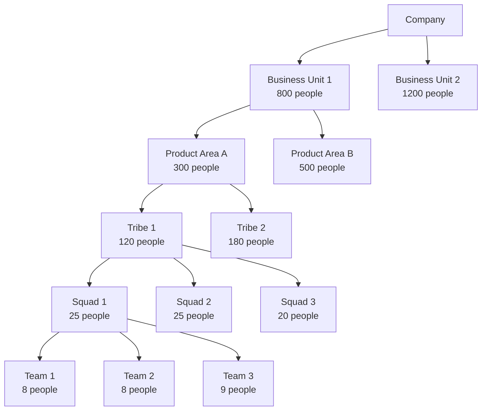

## Overview

|Unit|Size|Contains|Leadership|
|---|---|---|---|
|**Team**|5-12|Engineers|Team Lead|
|**Squad**|15-30|2-4 Teams|Squad Lead|
|**Tribe**|50-150|4-12 Teams|Tribe Lead|
|**Product Area**|100-500|Multiple Tribes|Product Director|
|**Business Unit**|200-2000+|Multiple Areas|VP Engineering|

## Hierarchy Structure

## Unit Breakdown

|**Unit Type**|**Typical Size**|**Purpose**|**Examples**|
|---|---|---|---|
|**Development Team**|5-12 people|Feature delivery|Backend API Team, Frontend UI Team|
|**Squad/Pod**|15-30 people|Feature area|Payments Squad, Search Squad|
|**Tribe/Group**|50-150 people|Product domain|E-commerce Tribe, Content Tribe|
|**Product Area**|100-500 people|Business capability|Customer Platform, Core Commerce|
|**Business Unit**|200-2000+ people|Major business line|Consumer Apps, Enterprise|

## Key Characteristics

|Unit|**Autonomy**|**Coordination**|**Focus**|**Meets**|
|---|---|---|---|---|
|**Team**|High|Low|Features|Daily|
|**Squad**|High|Medium|Features|Weekly|
|**Tribe**|Medium|Medium|Domain|Weekly|
|**Product Area**|Low|High|Capability|Bi-weekly|
|**Business Unit**|Very Low|Very High|Business|Monthly|

## Real-World Examples

|Company|Unit Name|Size|Structure|
|---|---|---|---|
|**Spotify**|Tribe|50-150|Squads + Chapters|
|**Google**|Organization|500-2000|Teams → Clusters → Org|
|**Amazon**|Service Team|100-500|Two-Pizza Teams|
|**Netflix**|Platform Team|50-200|Focused teams|
## Growth Stages

|Company Size|Recommended Structure|Focus|
|---|---|---|
|**< 50**|Teams + Squads|Speed|
|**50-200**|Squads + Tribes|Coordination|
|**200-1000**|Tribes + Product Areas|Alignment|
|**1000+**|Full Hierarchy|Governance|
## Best Practices

### 1. Clear Ownership

Each unit owns:
- Specific capabilities
- Clear boundaries
- End-to-end responsibility
- No shared ownership
### 2. Alignment Mechanisms

|Unit Size|Alignment Method|
|---|---|
|< 50|Daily standups|
|50-150|Tribe syncs|
|150-500|Area reviews|
|500+|Executive OKRs|
### 3. Metrics by Unit

| Unit              | Key Metrics                     |
| ----------------- | ------------------------------- |
| **Team**          | Velocity, Deployment Frequency  |
| **Squad**         | Feature Completion Time         |
| **Tribe**         | Domain Health Score             |
| **Product Area**  | Customer Satisfaction           |
| **Business Unit** | Revenue Impact, OKR Achievement |
|                   |                                 |
## Quick Reference

Team (5-12) → Squad (15-30) → Tribe (50-150)  → Product Area (100-500) → Business Unit (200-2000+)

> [!tip] **Choosing Unit Size**
> 
> - **Startups**: Squads only
> - **Growth**: Add Tribes
> - **Scale**: Add Product Areas
> - **Enterprise**: Full hierarchy

> [!warning] **Common Pitfalls**
> 
> - Too many layers
> - Unclear boundaries
> - Matrix organization confusion
> - Clear ownership
> - Minimal dependencies

> [!abstract] **Golden Rule** **"Units should be able to operate independently with minimal coordination"**
