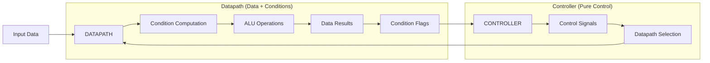

## 1. Controller–Datapath Model (from CPU Architecture)

### Datapath
The datapath contains registers, ALU, multiplexers, buses, and memory interfaces. It performs operations on data: arithmetic, logic, movement, comparisons. It does not decide _when_ work is done; it only manipulates data.
### Controller
The controller generates control signals, sequencing, branching, and instruction decoding. It decides _when_ each datapath action should run based on state and instructions.
### Relationship
The datapath provides capabilities. The controller provides rules, sequencing, and constraints. Together they form a complete computation. This helps generalize systems where data transformation is separated from logic and rules.

# Controllers: FSM-Based vs Non-FSM-Based

Controllers can be grouped into two families:

1. **Explicit FSM Controllers**  
    They have a **finite number of discrete states** and explicit transitions.
2. **Non-FSM Controllers**  
    They do not rely on a traditional FSM model.  
    Their behavior is dynamic, data-driven, or continuous.

This classification applies across CPU design, digital logic, embedded systems, and software system controllers.

# 1. Controllers With an FSM

These controllers have clear states and transitions (Mealy, Moore, or equivalent).
### Examples:
- Hardwired CPU control units
- Classic microcontroller state machines
- Protocol controllers (UART, SPI, I2C)
- Step-by-step datapath controllers
- Pipeline stall/flush controllers
- Bus arbitration controllers
- High-level synthesis (HLS) scheduled controllers
- Workflow engines modeled as state charts
### Characteristics:
- Behavior predictable and fully enumerated
- Well-structured state transitions
- Good for safety-critical and deterministic control
- Typically small to medium complexity
- Easier formal verification
- Highly optimized for speed and reliability
### Role:
FSM controllers control **when** datapath operations occur by stepping through predefined states.

# 2. Controllers Without an FSM

These controllers do _not_ use a classic finite-state machine even if they implicitly have “states” in a broader sense.

### Examples:
- Microprogrammed controllers (microcode sequences)
- Out-of-order execution controllers (dynamic scheduling)
- Branch predictors
- Reorder buffers, reservation stations
- OS schedulers
- Autoscalers in distributed systems
- Continuous controllers (PID, MPC)
- Neural-network-based controllers
- Event-driven controllers (reactive, rule-based)
- Policy-driven controllers (Kubernetes controllers, cloud control loops)
### Characteristics:
- Behavior depends on **data**, **predictions**, or **policies**, not fixed transitions
- Often unbounded or very large state space
- More adaptive and flexible
- Harder to formally verify
- Scalable to higher complexity
- Often asynchronous and concurrent
### Role
Non-FSM controllers enable **adaptive, data-dependent, or probabilistic** control rather than predefined sequences.

# 3. Mixed / Hybrid Controllers

Some controllers combine FSMs with non-FSM components.
### Examples:
- Pipeline controllers using FSM for hazards + prediction unit for branches
- Microcode systems where a micro-instruction controls a tiny FSM subset
- Cloud autoscaling with rule-based FSM plus predictive ML model
- Hybrid robotic controllers (FSM + PID + MPC)
### Characteristics:
- Determinism for critical sections
- Flexibility for non-critical or high-variance sections
- Best of both worlds but more complex