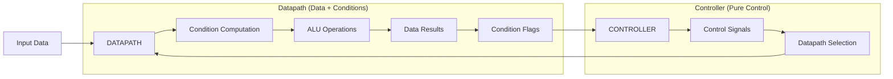

## 1. Controller–Datapath Model (from CPU Architecture)

### Datapath
The datapath contains registers, ALU, multiplexers, buses, and memory interfaces. It performs operations on data: arithmetic, logic, movement, comparisons. It does not decide _when_ work is done; it only manipulates data.
### Controller
The controller generates control signals, sequencing, branching, and instruction decoding. It decides _when_ each datapath action should run based on state and instructions.
### Relationship
The datapath provides capabilities. The controller provides rules, sequencing, and constraints. Together they form a complete computation. This helps generalize systems where data transformation is separated from logic and rules.

